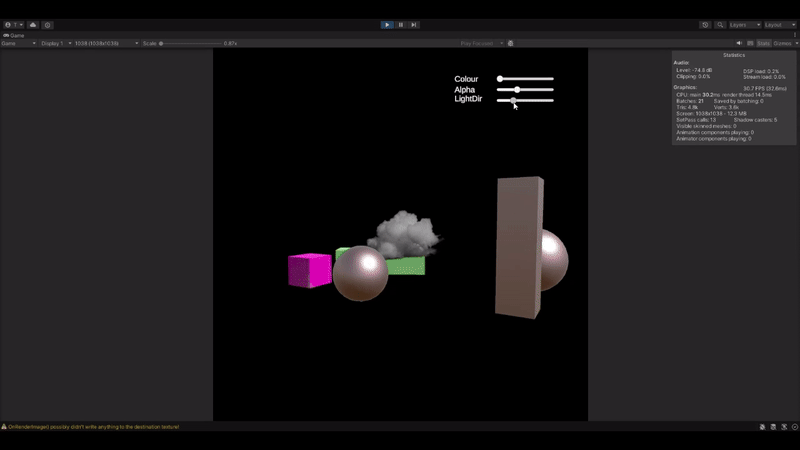
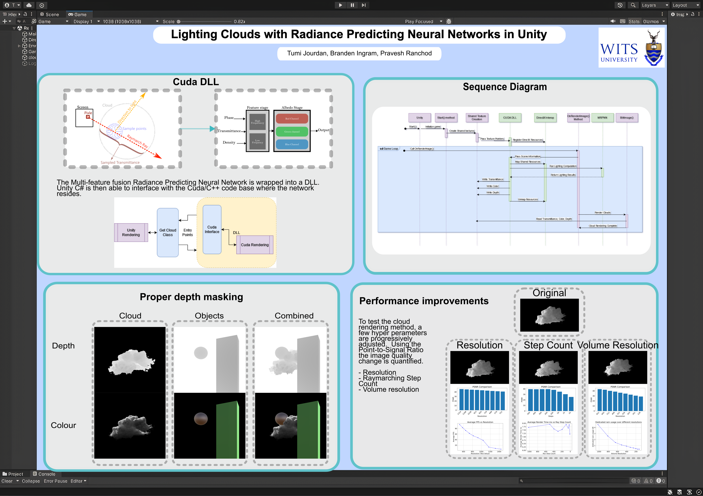

# MRPNN Unity DirectX Interop
---

---
This project integrates the neural network developed by Jinkai Hu and Chengzhong Yu and Hongli Liu and Ling-qi Yan and Yiqian Wu and Xiaogang Jin, their project at  [github link](https://github.com/What-a-stupid-username/MRPNN/blob/main/README.md) into the unity graphics pipeline. 
---
## Running program. 
### Requirements
- CUDA 11.8
- Windows
- Nvidia GPU that supports sm_75 or sm_86
- Visual Studio 16 2019
Test with Geforce RTX3060

### To build on Windows:
- Install CUDA 11.8.
- Download project files from github.
- Run CMAKE using in the CudaDLL-VS-Files.  
    Example cmake: cmake -G "Visual Studio 16 2019" -A x64 -T cuda="C:/Program Files/NVIDIA GPU Computing Toolkit/CUDA/v11.8" -DCMAKE_CUDA_FLAGS="-allow-unsupported-compiler" -DRTX30XX=ON -B build  
DRTX either on or off if you have an RTX3000 series card  
- In the visual studio project that is then generated, right click on the volume render project to generate the DLL file.
- Move this DLL file then to the Plugins folder in the unity project.
- The unity program relies on a cloud file in the streaming assets folder. This can be access from the MRPNN researchers google drive at [OneDrive](https://1drv.ms/f/c/c6d71596bc679f33/QjOfZ7yWFdcggMZJBAAAAAAATuOe1hNOeD_D7Q)
- Open the unity project, majority of settings are on the GetCloud.cs script that is attached to the camera in the scene.
- Make sure that the correct cloud model is selected in the drop down Cloud_to_render.
- NB. Make sure the DLL in the plugins has the Load on StartUp option checked. 
